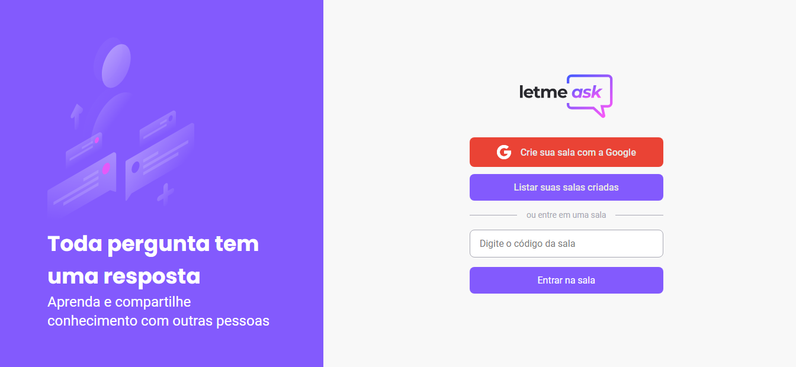

<h1 align="center">
  
</h1>

  <a href="#-tecnologias">Tecnologias</a>&nbsp;&nbsp;&nbsp;|&nbsp;&nbsp;&nbsp;
  <a href="#-projeto">Projeto</a>&nbsp;&nbsp;&nbsp;|&nbsp;&nbsp;&nbsp;
  <a href="#-Site">Site</a>&nbsp;&nbsp;&nbsp;|&nbsp;&nbsp;&nbsp;
  <a href="#-como-executar">Como executar</a>&nbsp;&nbsp;&nbsp;|&nbsp;&nbsp;&nbsp;

 

  

## ✨ Tecnologias

Esse projeto foi desenvolvido com as seguintes tecnologias:

- [React](https://reactjs.org)
- [Node.js](https://nodejs.org/)
- [TypeScript](https://www.typescriptlang.org/)
- [Modal](https://react-hot-toast.com/)
- [Firebase](https://firebase.google.com/?hl=pt)
- [Scss](https://sass-lang.com/documentation/syntax)

## 💻 Projeto

O Letmeask é um aplicativo que facilita na organização de perguntas e respostas dentro de uma sala virtual.

## 🔖 Site

Você pode visualizar o projeto no site através [desse link](https://letmeask-c8f6e.web.app/).

## 🚀 Como executar

- Clone o repositório
- Instale as dependências com `npm`
- Inicie o projeto `npm run start`

Feito com ♥ by João Vitor 👋🏻 
Obrigado a todos! ♥
